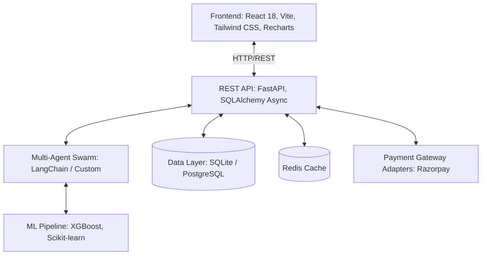
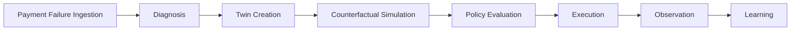
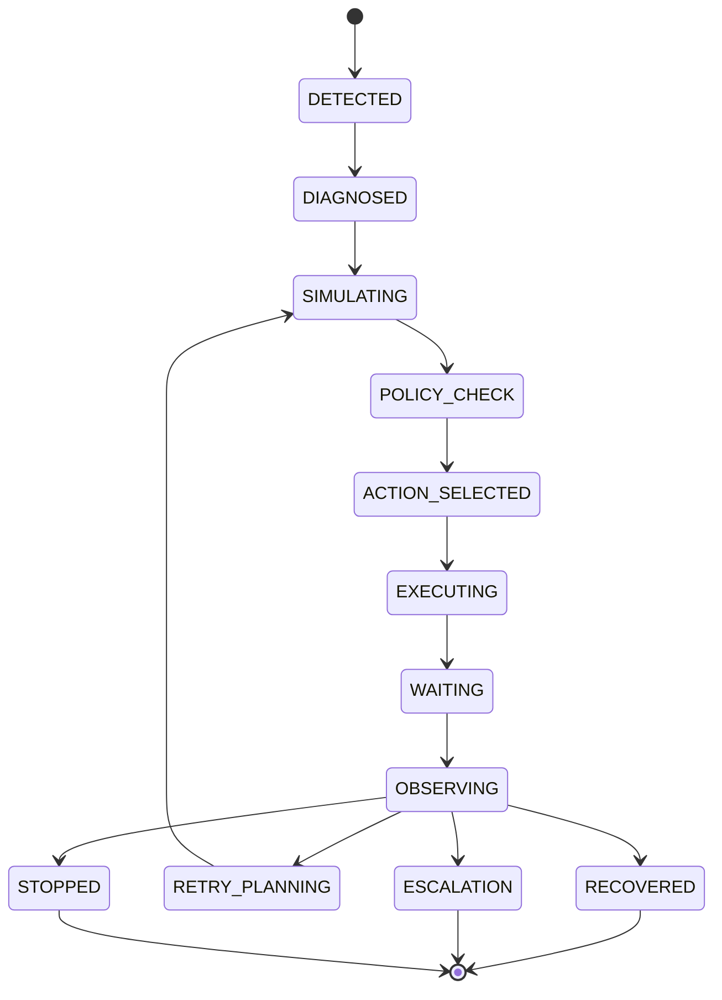
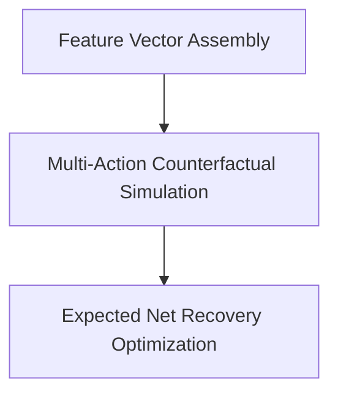
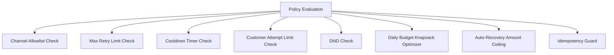
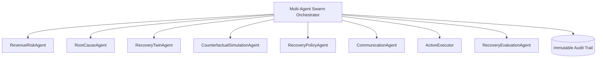
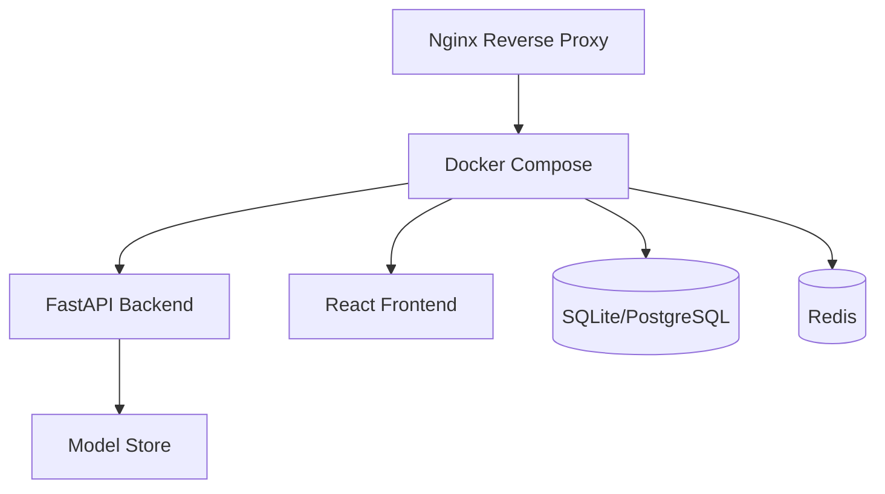

# RecoverX AI Revenue Recovery Twin Architecture

## 1. High-Level System Architecture Diagram

## 2. End-to-End Data Flow Diagram

## 3. Recovery State Machine Diagram

## 4. Counterfactual Engine Architecture Diagram

**Expected Net Recovery Optimization Formula:**
$$ \text{ENR} = P_{\text{rec}} \times \text{Amt} - \text{Cost} - \text{FrictionCost} $$

## 5. Deterministic Policy & Safety Guardrails Diagram

## 6. Multi-Agent Orchestration & Audit Trail

## 7. Deployment & DevOps Architecture Diagram

